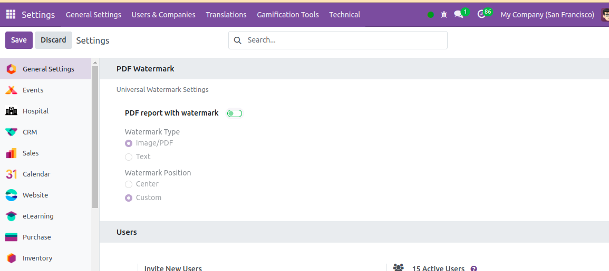
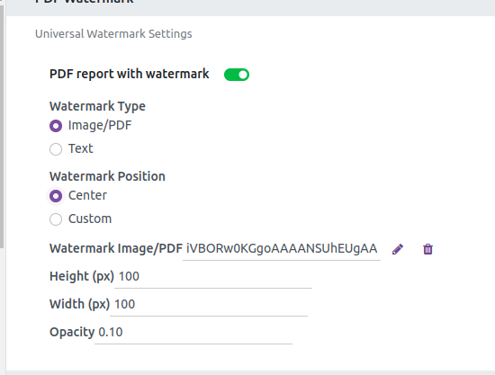
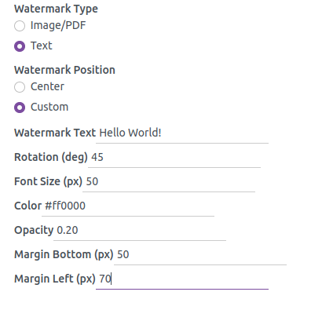
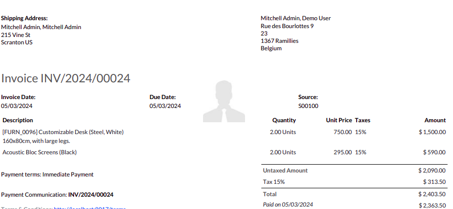
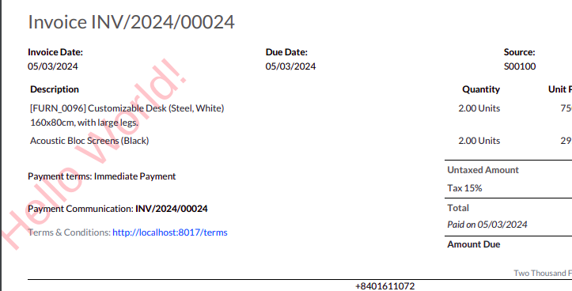

Universal PDF Watermark Module for Odoo
=======================================

This module provides functionality to add image, PDF, and text watermarks to your PDF reports in Odoo with customizable positions and settings.

Features
--------

- Add image, PDF, or text watermarks to PDF reports.
- Set watermark position to center or custom positions using margins.
- Customize image watermark with height, width, and opacity settings.
- Customize text watermark with text, rotation, font size, font color, and opacity settings.

Installation
------------

1. Clone the repository into your Odoo addons directory:

   .. code-block:: bash

      git clone https://github.com/AnandShah10/watermark_pdf_report.git

2. Restart the Odoo server.
3. Activate the developer mode in Odoo.
4. Update the app list.
5. Install the "PDF Watermark Module" from the list of available apps.

Usage
-----

After installing the module, you can configure the watermark settings from the PDF report settings in your Odoo instance. Follow the instructions below to set up your watermarks:

1. **Watermark Type**: Select the type of watermark you want to add:
   - **Image**: Upload an image and set its height, width, and opacity.
   - **PDF**: Upload a PDF to use as a watermark.
   - **Text**: Enter the text for the watermark and customize its appearance.

2. **Position**: Choose the position for the watermark:
   - **Center**: The watermark will be centered on the PDF page.
   - **Custom**: Set the top, bottom, left, and right margins to position the watermark.

3. **Image Watermark Settings**:
   - **Height**: Set the height of the image.
   - **Width**: Set the width of the image.
   - **Opacity**: Set the opacity of the image (0-100%).

4. **Text Watermark Settings**:
   - **Text**: Enter the text for the watermark.
   - **Rotation**: Set the rotation angle of the text.
   - **Font Size**: Set the font size of the text.
   - **Font Color**: Choose the color of the text.
   - **Opacity**: Set the opacity of the text (0-100%).

Screenshots
-----------

Watermark Type Selection
~~~~~~~~~~~~~~~~~~~~~~~~

Image Watermark Settings
~~~~~~~~~~~~~~~~~~~~~~~~

Text Watermark Settings
~~~~~~~~~~~~~~~~~~~~~~~

Output Examples
~~~~~~~~~~~~~~~

Image Watermark Output
~~~~~~~~~~~~~~~~~~~~~~

Text Watermark Output
~~~~~~~~~~~~~~~~~~~~~

Contributing
------------

If you would like to contribute to this module, please fork the repository and submit a pull request. We appreciate your help!

License
-------

This module is licensed under the GPL-3 License. See the LICENSE file for more details.

Contact
-------

For any questions or inquiries, please contact us at `shahanand1072004@google.com`.
